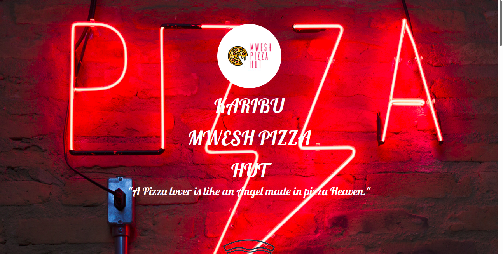

### **MWESH PIZZA HUT**
# **Author - Maxwell Munene**
_This  project features a PIZZA WEB APP CALLED "MWESH PIZZA HUT"._

#### **User Stories**

A a customer, I would like to;

1. Choose the size of pizza I want e.g Small, Medium, Large
2. Choose what kind of crust I would like the pizza to have e.g Crispy, Stuffed, Gluten-free
3. Choose the topping(s) I want on my pizza.
4. Place an order for my Pizza and see the total charge for it.
5. Have an option to order as many pizzas as I want.
6. Have an option to have the pizza delivered or not.  If delivered I want to be alerted how much the delivery charge will be.
7. If I want my pizza to be delivered, I want to be prompted to enter where the delivery should be made and an alert saying '' your order will be delivered to your location"
8. See a checkout button that when clicked shows the total amount charged for the orders.

 (USER INTERFACE)

#### **PROJECT OBJECTIVES**
1. The project code uses constructors in Javascript.
2. The project makes use of prototypes in Javascript.
3. The project implements one or more Javascript functions.
4. The project separates the business logic code from the UI logic code.
5. The web app uses bootstrap and media queries to make it fully responsive.
6. The javascript code uses the correct syntax of camel case naming of variables. I.e var myVariable = "stores something"; instead of var my_var = "stores something", or, var MyVar = "stores something" , or,  var my-Var = "stores something"

#### **REQUIREMENTS**
## **PIZZA PLACE WEB APP.**
1. Determine the prices for each pizza size.
2. Each pizza topping should have a set value depending on the size of the pizza.
3. Determine the cost for the crust
4. The total cost of a pizza should constitute, the crust, topping(s) and size of the pizza.
5. On checkout, the application displays the orders’ summary together with the total amount charged. For example, if the customer has made more than one pizza order, on checkout the application displays a summary of all the orders he/she has made and the total amount to pay for all his/her orders.

## Installation and Set-up
To view the webpage, open the Github Pages link provided below on the README.

Here is a systematic setup of how to template the Website
* Step 1 : Clone this repository **`git clone https://github.com/tailorv/pizzashop.git`**,or downloading a ZIP file of the code.
* Step 2 : The repository, if downloaded as a .zip file will need to be extracted o your preferred location and opened
* Step 3 : Open the index.html file to view the webpage on your preferred browser

## Github Pages link

You can view the live webpage by following this link https://tailorv.github.io/pizzashop/

#### **CONTACT**
>Maxwell.Munene@student.moringaschoolcom  

#### **COPYRIGHT & LICENCE**
Distributed under the MIT License. See LICENSE for more information on license and copyright.
